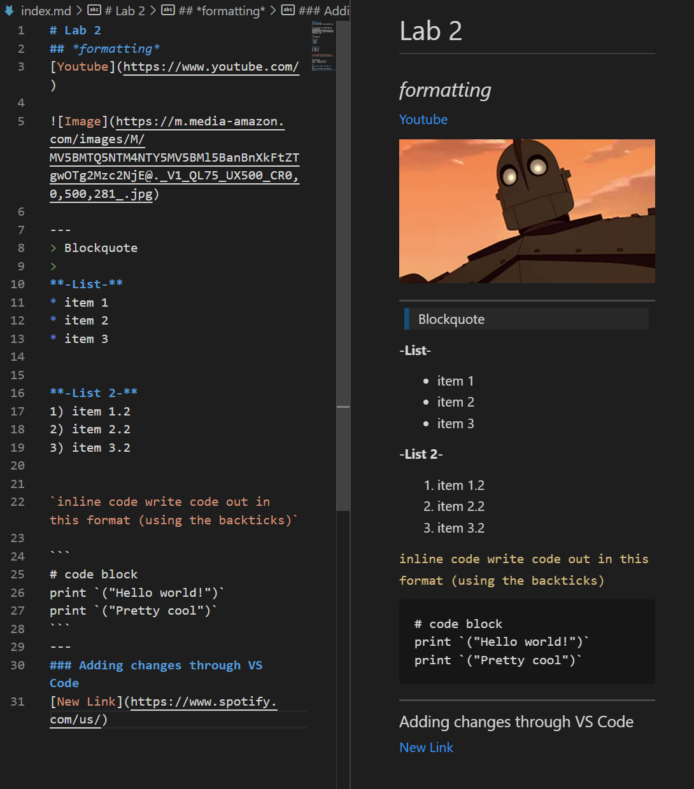

# Installing VS Code

*
---
# Remotely Connecting

*
---
# Trying some Commands

*
---
# Moving Files with SCP

*
---
# Setting an SSH Key

*
---
# Optimizing Remote Running

*
---

# Placeholder image for rn

---
