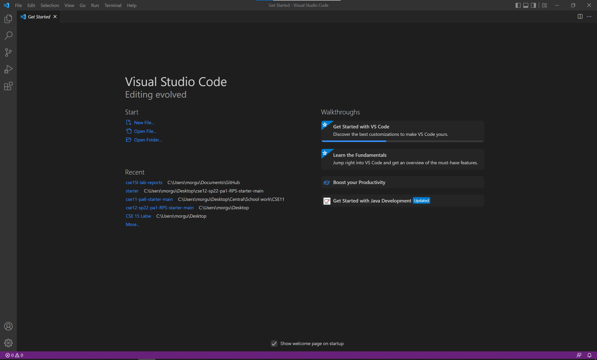

# Installing VS Code


1. Go to [VSCode download](https://code.visualstudio.com/download) and download Visual Studio code based on what operating system you are using
2. After the file downloads run the file and have it install VScode 
3. After the file downloads open VSCode and the home should look like the image above.

---
---

# Remotely Connecting

1. First find your CSE course-specific account if you have one [here](https://sdacs.ucsd.edu/~icc/index.php)  
2. Ensure that you have OpenSSH downloaded and if you do not go to [OpenSSHDownload](https://docs.microsoft.com/en-us/windows-server/administration/openssh/openssh_install_firstuse) to download it
3. Open VSCode and open a new terminal which can be done at the top or by hitting ctrl+shift+`
4. Next use the account which should be cs15lsp22(your account here)@ieng6.ucsd.edu and hit enter 
5. type in your password and hit enter again 
6. Say yes to the questions that are prompted to you
7. The final results will take you to a screen that looks like the one above in VSCode

---
---

# Trying some Commands


1. Once you have logged into your remote account you can now use commands 
2. These commands are able to do various things and you can simply just type them out
3. You can find a list of commands [here](https://www.hostinger.com/tutorials/ssh/basic-ssh-commands)
4. An example of running the command ls is listed above

---
---

# Moving Files with SCP


1. Nice! You have logged in now lets move some files remotely
2. You can achieve this by using the scp command and you will use it offline the system
3. Create a java file of your choice and add whatever you want inside of it
4. Next make sure you are not connected the server and if you are not type in 
    ```
    scp (file_name.java) cs15lsp22zz@ieng6.ucsd.edu:~/
    ```
5. Type in your password similarly to what we did in the Remotely Connecting portion of this page
6. Next, log bag into the remote server 
7. The file should appear in your directory which you can find using ls and an example is shown above

---
---

# Setting an SSH Key


1. So up until now we have been needing to use passwords quite often
2. However! It doesn't have to be that way if we use SSH Keys
3. For this we have to set it up on the client side so log off of the server if you are logged in
4. type in the command ssh-keygen into the terminal
5. It will generate a public and private rsa key pair
6. The file will need to be saved so use the following format to save the keys 
    ```
    (/Users/<user-name>/.ssh/id_rsa): /Users/<user-name>/.ssh/id_rsa
    ```
    You can use a passphrase although leaving it blank will not add one which is recommended 
7. If using windows you will have to follow a few more steps which you can find [here](https://docs.microsoft.com/en-us/windows-server/administration/openssh/openssh_keymanagement#user-key-generation)
8. Ok so now that we have this all set up will we be moving one of the keys to the remote server (*public key specifically*)
9. Use the following command on the client side so log out if you are logged in
    ```
    scp /Users/<user-name>/.ssh/id_rsa.pub cs15lsp22(your account here)@ieng6.ucsd.edu:~/.ssh/authorized_keys
    ```
10. finally once you move it over you should be able to just type in the ssh login command and you will not have to use your password anymore! 

---
---

# Optimizing Remote Running


1. Nice you now do not have to type in your password every time you log in on your current device.
2. Ok so how about running things a bit more *smoothly* once you have logged in?
3. First, we can do one of two things and that is typing commands out before you even log in which looks like:
    ```
    ssh cs15lsp22(username)@ieng6.ucsd.edu "(command here)"
    ```
4. Secondly, you can run multiple commands at once which looks like:
    ```
    javac WhereAmI.java; java WhereAmI 
    ```
5. An example of running the command while logging in is listed above!

---
---

That is it for downloading VSCode and setting up remote connecting using an ieng6 account!
We learned a lot of steps about setting up your environment and being able to run certain commands with a lot more fluidity.
Hope this helps!
