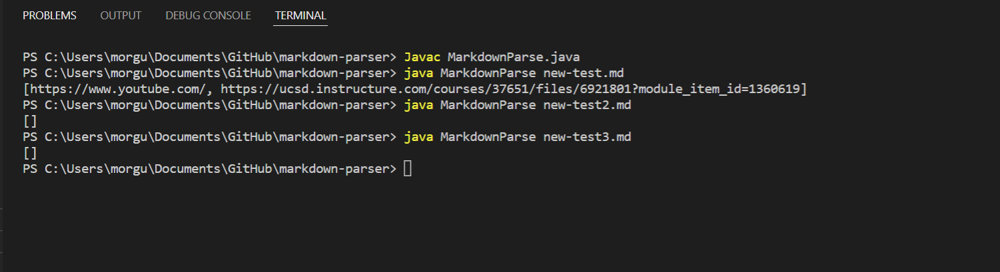

# Lab Report 2 Week 4

The purpose of this report is to show the writing process when it comes to code. We will be using markdown-parser as our main file and putting it through several tests. There are 3 issues we are going to fix with the code and show how the errors appeared and how they are fixed. 

## Error 1 - Infinite Loop

[Test File 1 Link](https://github.com/Gus-Mora/markdown-parser/blob/main/new-test.md)

 

The visible symptom shown in the terminal was that there was a memory issue caused by the code running infinitely. The logic error that created this was that the code did not check for when the link was over and would continue to check for links if there was an empty line after a link. The input was faulty because it had an empty space after the links making the code look for more links infinitely instead of just stopping.

---

## Error 2 - Interpreting Images as Links

[Test File 2 Link](https://github.com/Gus-Mora/markdown-parser/blob/main/new-test2.md)

 

Here we see the failure inducing input was that we were using images instead of links. Although they are formatted in a similar way images use an ! before the []. The logic error was that the code would simply ignore the exlamation make and read the images as links which created the visible symptom of the image file names being displayed as link addresses.

---

## Error 3 - Wrong Formatting for Links

[Test File 3 Link](https://github.com/Gus-Mora/markdown-parser/blob/main/new-test3.md)

Finally we have the final test that results in an error showing the visible symptom of a link address that is just words. The link should not display the URL if there is no name attached to it as in markdown it will not display that link to the viewer. The logic error is similar to the one above in that reading [] the code does not see an issue with there being no words within it. This all resulted in the faulty input of having [] with no name attached to it.

---

### Code runing properly

Here we can see that after changing the code and running the test files again the desired outputs are shown.

---
