# Lab Report 3 Week 6

## Streamlining SSH Config
The purpose of this part is to show how you can make logging into the remote server with more ease. 
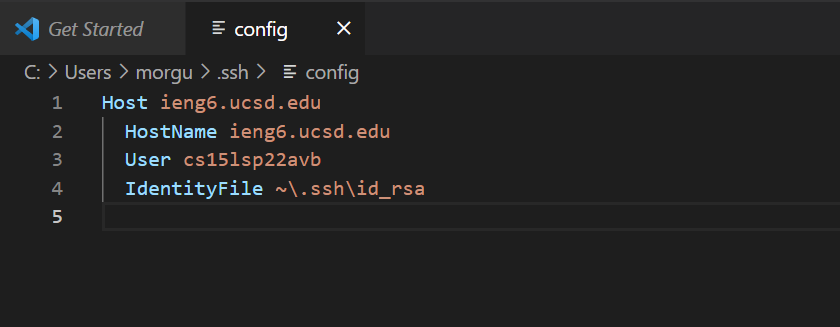

Here we are looking at the config file and we can see what the host name is which we will use and the other necessary comments. The host is what we will be known as our alias and what we will use to log in.

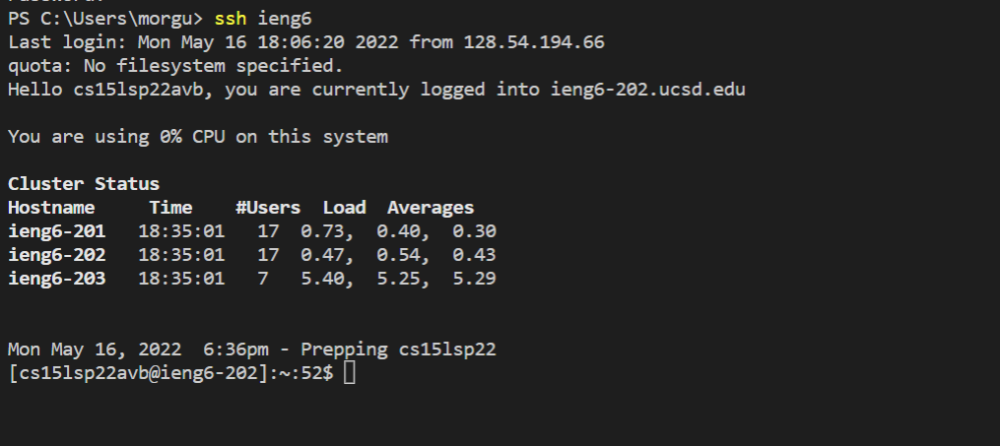

As you can see here all we have to do is type in `ssh ieng6` and hit enter to be able to log into the remote server.

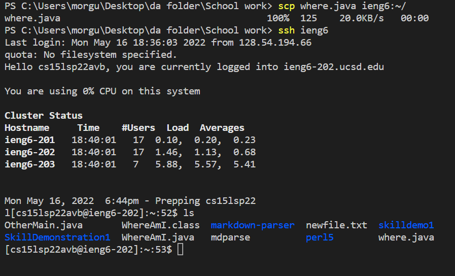

As you can see we no longer have to type out our whole name (cs15lsp22zzz@ieng6.ucsd.edu) as we can just use ieng6 in order to log ourselves now.

______

## Setup Github Access from ieng6
In setting up remote access to Github from our ieng6 we are able to access a lot of the features from Github while in the remote server. This helps to streamline things as commands will now always be in the Linux format and collaborating with others is easier since we do not have to go from windows to another operating system it can all be done on the same one.

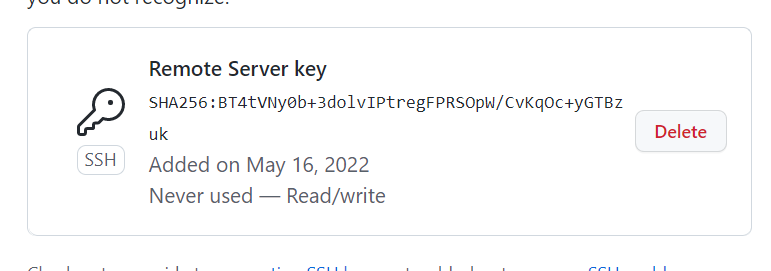

So after setting up the keys in our remote server we are able to transfer it to our Github profile. By going to the access bar and adding it to the ssh keys.

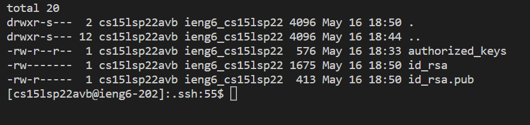

This just shows where the files are located within our remote server and the date they were modified.

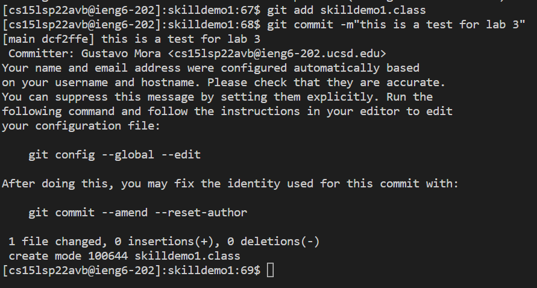

Here we were able to commit a file to our Github page using the remote access

___________

## Copy Whole Directories with scp -r
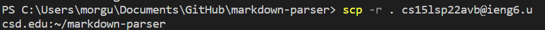

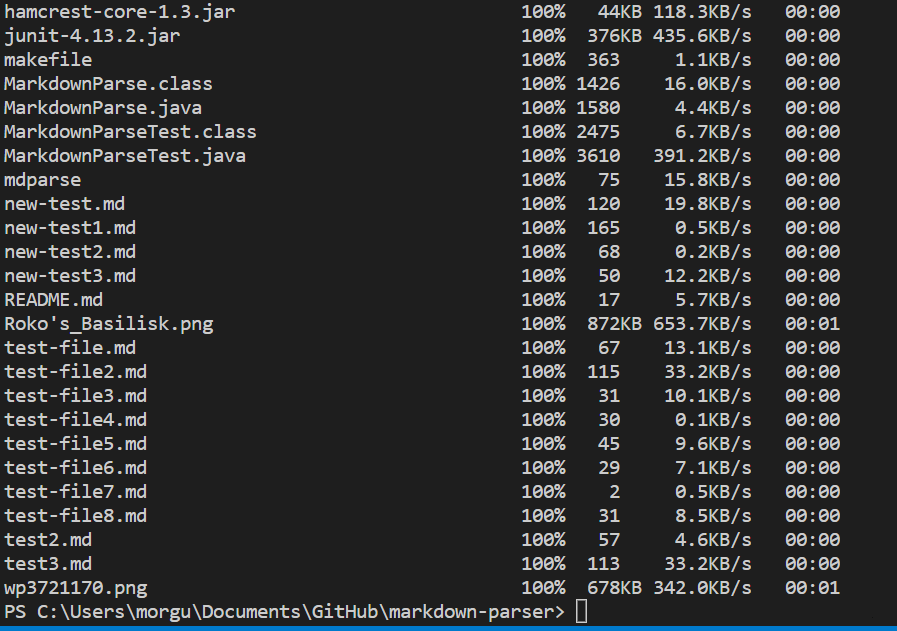

Here we are now able to use `scp -r` and then state to which account and what directory we want to copy to the new account. This is helpful in transferring local files attached to a larger project to the remote server all at once instead of in pieces.

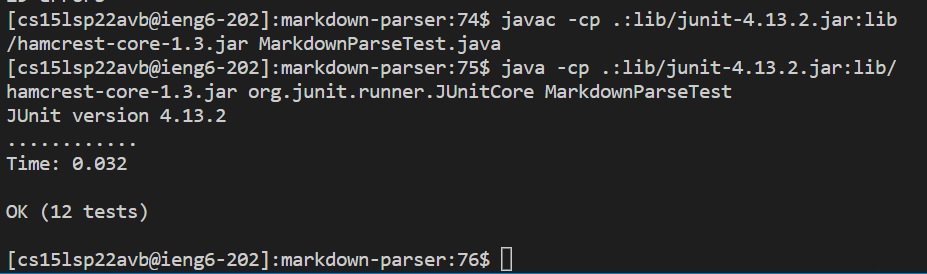

This is showing how the test file was able to be transferred and still able to run while on the remote server now.

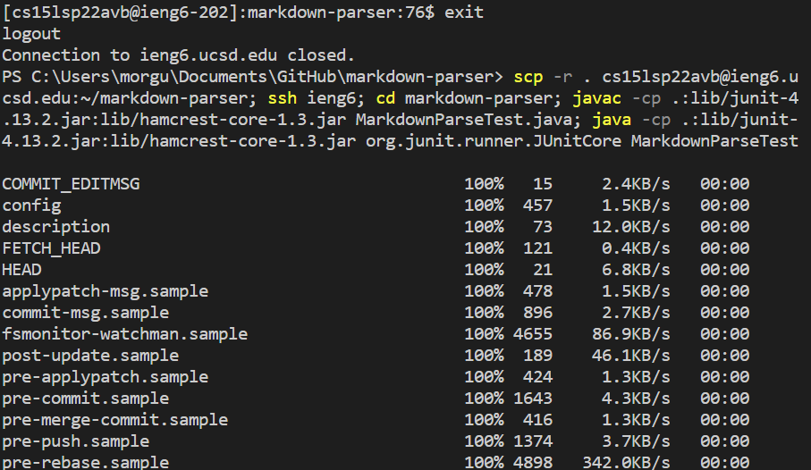

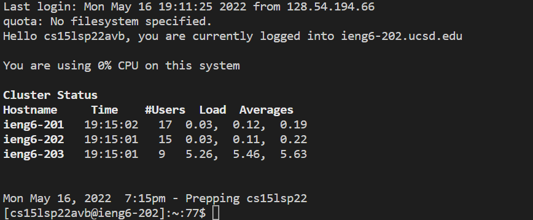

Now we are able to use everything we have learned so far in order to combine all the commands into one line using `;` so that we can run it all as one command instead of as multiple commands one at a time.

_________

