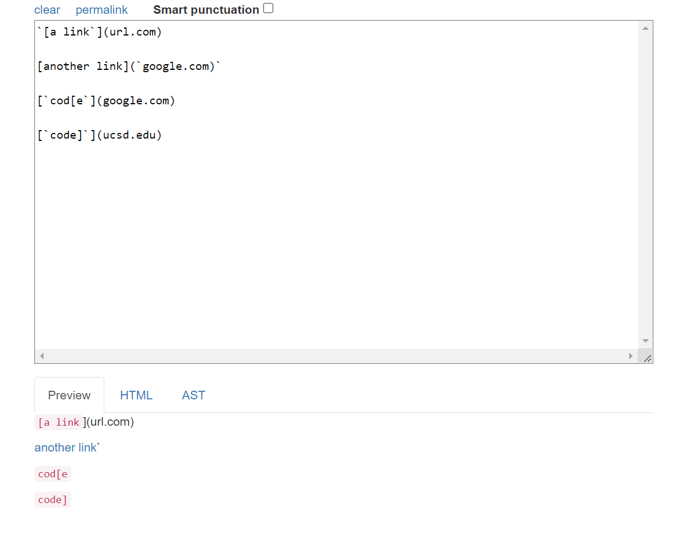
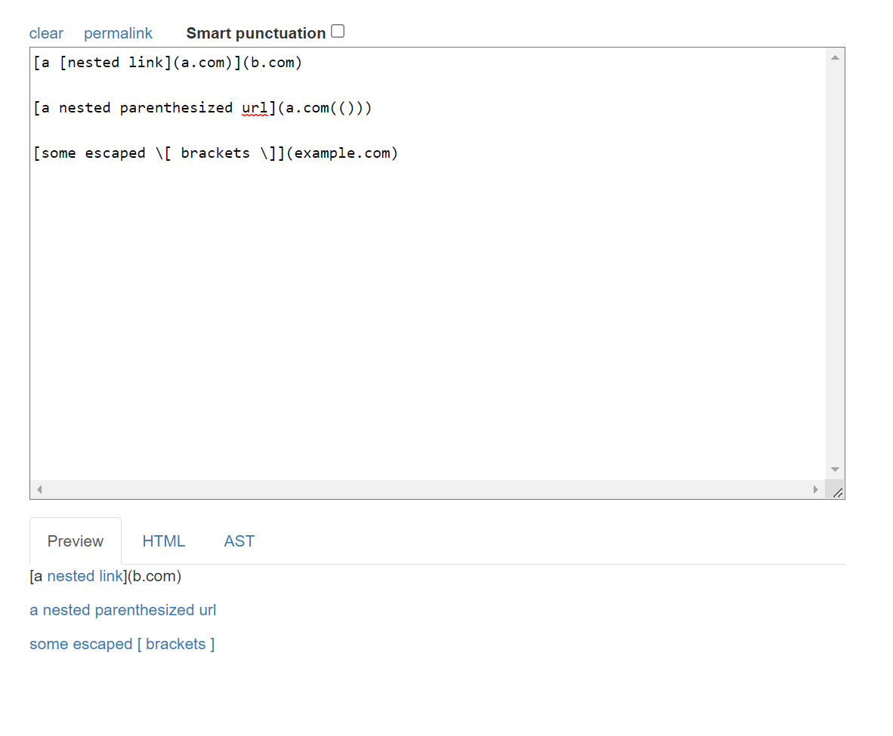
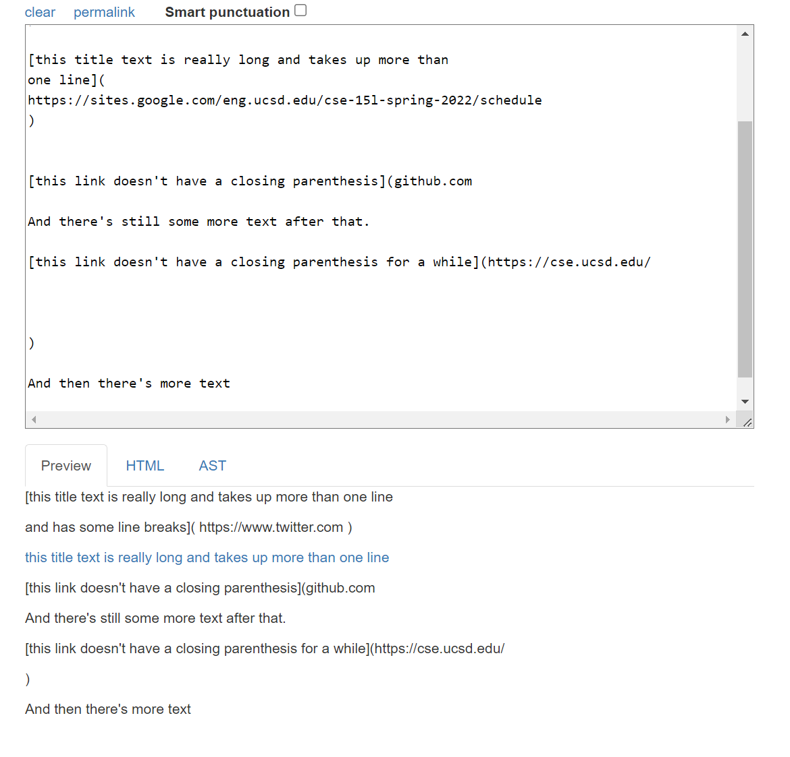
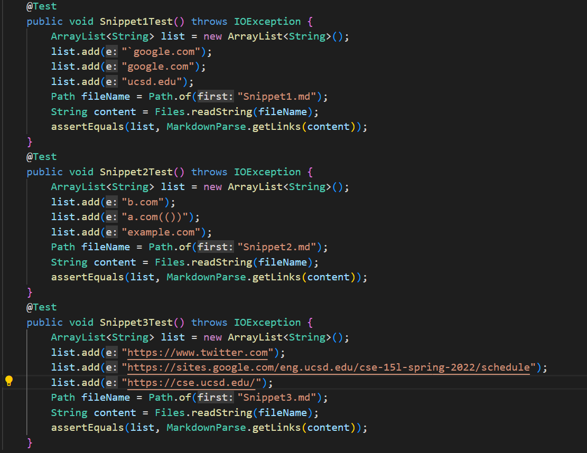
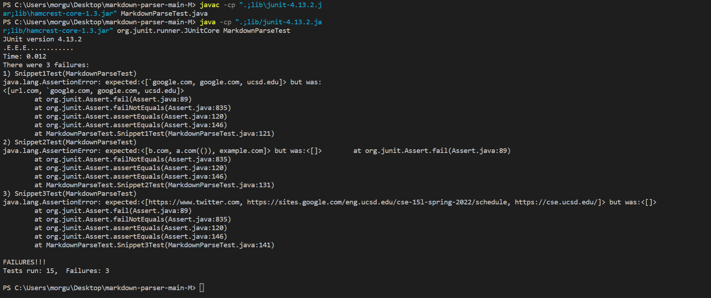
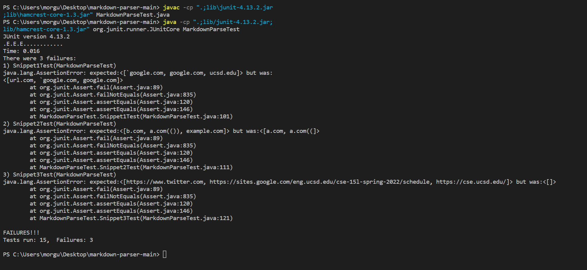

# Lab Report 4 Week 8

## Reposotories 
[My repository](https://github.com/Gus-Mora/markdown-parser)
[Repository of Group We Reviewed](https://github.com/kaileywong/markdown-parser)
________
## Expected Outcomes of Snippets
Using the [CommonMark demo site](https://spec.commonmark.org/dingus/) here are the expected results for the snippets 
### Snippet 1

### Snippet 2

### Snippet 3

_________
## Created Tests

_________
## Outcomes for My Reposotory

The three tests failed shown above with the tests for Snippet 1,2 and 3 all failing. The expected outcomes were different than the result so this resulted in the tests failing. 
## Outcomes for Repository of Group We Reviewed

Much like my code, the tests for the group we reviewed also failed. This is shown again by the tests for Snippet 1,2 and 3 all failing as shown above. 
______
## Potential Fixes 
### Fix for Snippet 1

### Fix for Snippet 2

### Fix for Snippet 3
